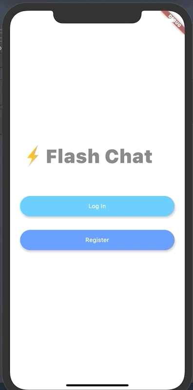
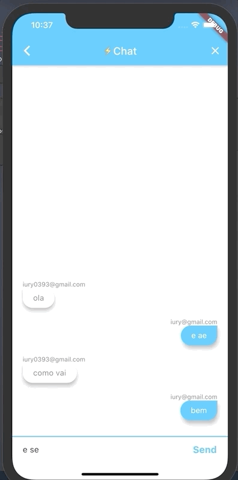
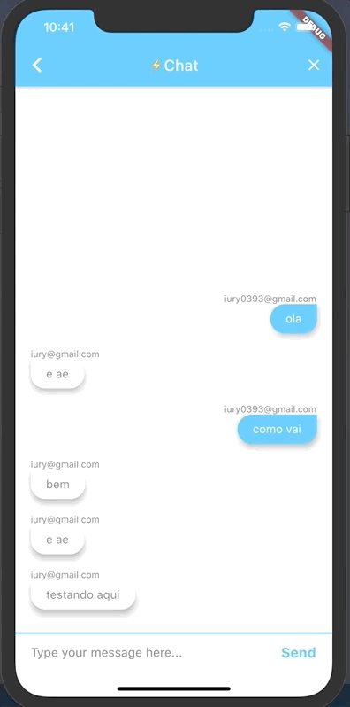

[](https://flutter.dev/docs/get-started/install)  [](https://developer.android.com/studio) [](https://pub.dev/packages/animated_text_kit)
[](https://pub.dev/packages/firebase_core)
[](https://pub.dev/packages/firebase_auth)
[](https://pub.dev/packages/cloud_firestore)
[](https://pub.dev/packages/modal_progress_hud)
# FlashChat





## Tabela de Conteúdo
- <a href="#informações">Informações</a>
- <a href="#instalação">Instalação</a>
- <a href="#desenvolvedor">Desenvolvedor</a>

## Informações
Um aplicativo de mensagens moderno no qual os usuários possam se inscrever e fazer login para conversar.

## Instalação

Use ```git clone https://github.com/iury0393/flash-chat.git ``` para clonar o repositório.

Entre no ***Android Studio*** e abra o ***pubspec.yaml***.
Depois clique em ***Get Dependencies*** e, após a intalação, simule o aplicativo em um simulador.


## Desenvolvedor

| Nome | Função | Email |
| ------ | ------ | ----- |
| Iury Vasconcelos | Desenvolvedor | iury0393@gmail.com |